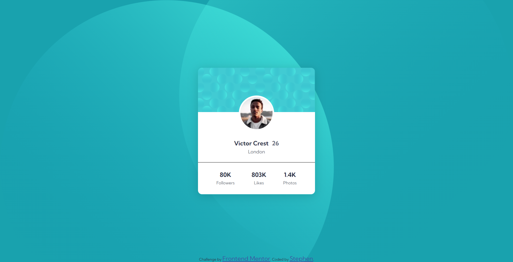

# Frontend Mentor - Profile card component solution

This is a solution to the [Profile card component challenge on Frontend Mentor](https://www.frontendmentor.io/challenges/profile-card-component-cfArpWshJ). Frontend Mentor challenges help you improve your coding skills by building realistic projects. 

## Table of contents

- [Overview](#overview)
  - [The challenge](#the-challenge)
  - [Screenshot](#screenshot)
  - [Links](#links)
- [My process](#my-process)
  - [Built with](#built-with)
- [Author](#author)

## Overview

### The challenge

- Build out the project to the designs provided

### Screenshot

### Links

- Solution URL: [Github Repo](https://github.com/steveoncaffeine/profile-card-component)
- Live Site URL: [Live Site](https://steveoncaffeine.github.io/profile-card-component)

## My Process

### Built with

- This project was built with HTML and CSS.

## Author
- Frontend Mentor - [@steveoncaffeine](https://www.frontendmentor.io/profile/steveoncaffeine)
- Twitter - [@steveoncaffeine](https://www.twitter.com/steveoncaffeine)

